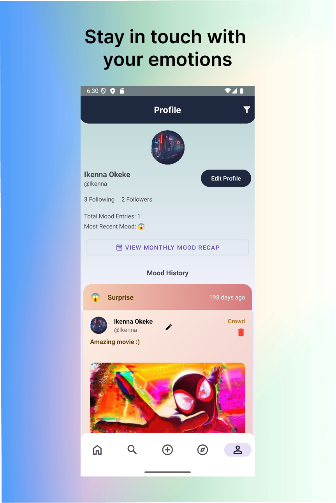

# 📱 MoodTracker

MoodTracker is a social media app that allows you to archive and share your emotional moments, big or small.<br > <br /> 
 

---

## 👥 The Development Team

| Name                  | GitHub Username     | 
|-----------------------|---------------------|
| Derek Dubrule         | derekjd1            |                       
| Harmanpreet Singh     | Harman-DevCloud     |
| Aaron Onate           | A-K-O               |                       
| Abdullah Aderinto     | aaderinto04         |                      
| Ikenna Okeke          | IkennaOkeke         |                       
| Michael Joshua Saul   | onionrings29        |                       


---

## 🎯 About Our App

*MoodTracker* helps you understand and take control of your emotional well-being. Whether you’re a student tackling midterms, a professional balancing deadlines, or just trying to figure out what’s throwing off your vibe today — we’ve got you covered. Log your moods, pin them to a map, choose what to share, and uncover patterns that help you grow.

Powered by Firebase, MoodTracker offers real-time syncing, offline access, secure authentication, and cloud storage built to protect your data. Your privacy stays intact, as well as your peace of mind.

---

## 🌟 What's In It For You

- **🎭 Effortless Mood Logging:** Record your highs, lows, and everything in between. Add photos, notes, locations — edit or delete whenever you like.
- **🔐 Privacy You Control:** Share publicly or keep it private. Your data stays yours — no tracking, no funny business.
- **📜 Your Mood Timeline:** Revisit past entries, filter by emotion or keyword, and discover what drives your ups and downs.
- **👥 Connect with Others:** Follow friends, see how they’re feeling, and support each other through the highs and lows.
- **🗺️ Mood Map:** Visualize your emotions on a map — explore your own moods or your circle’s.
- **💬 Join the Conversation:** Comment on public moods, offer support, and be part of a positive community.
- **🌐 Works Anywhere:** No internet? No problem. Log moods offline and sync automatically when you’re back online.
- **🔎 Custom Profiles:** Search users, view insights, and personalize your own space to reflect your personality.

---

## 🛠️ Get The App

Ready to get and stay in touch with your emotions? [Download](https://github.com/IkennaOkeke/Mood-Tracker/blob/main/MoodTracker.apk) the app.

#### OR

1. Add the app to your device by cloning the repository:

   ```bash  
   git clone https://github.com/cmput301-w25/project-team_16.git
3. Open Android Studio.
4. Navigate to the code directory:

   ```bash
   cd code
6. Click the Build button.
7. Open the app, create an account, and have fun!

---

## Documentation

- 📝 [Wiki](https://github.com/cmput301-w25/project-team_16/wiki)
- ✅ [Scrum Board](https://github.com/orgs/cmput301-w25/projects/92)
- 🎨 [UI Mockups](https://github.com/cmput301-w25/project-team_16/wiki/UI-Mockups-and-Storyboard-Sequence)
- 📊 [UML Diagram](https://github.com/cmput301-w25/project-team_16/wiki/UML)
- 📃 [Javadoc](docs/index.html)
